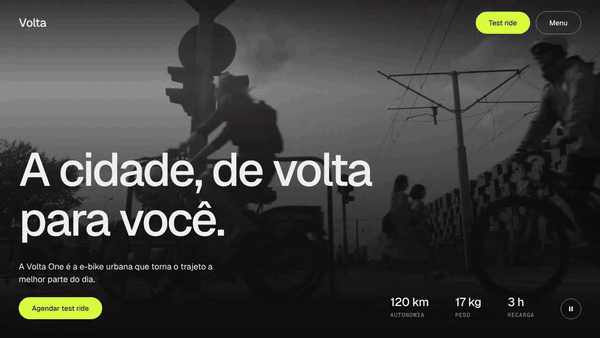
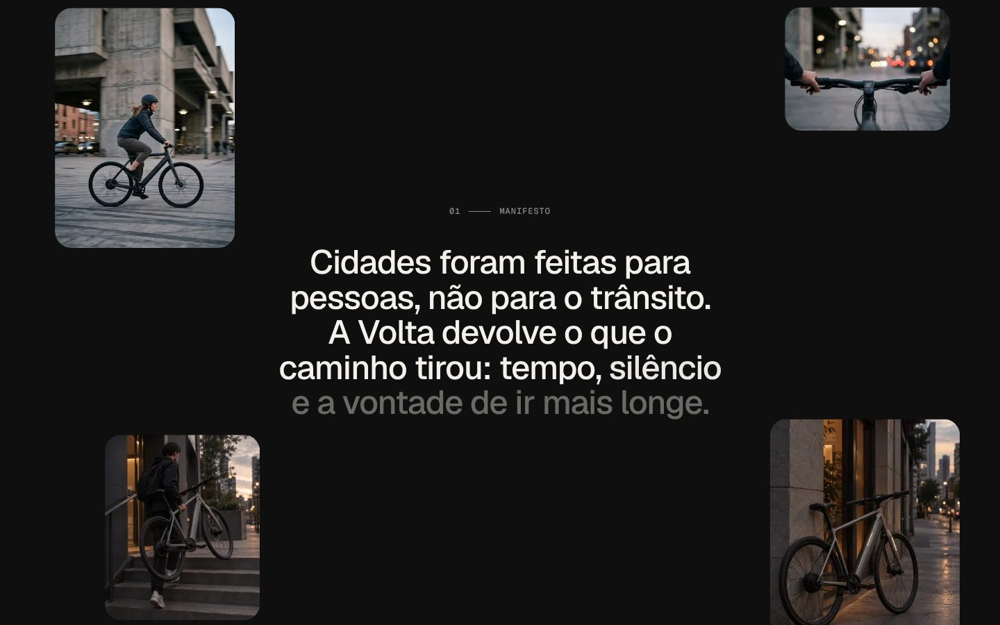
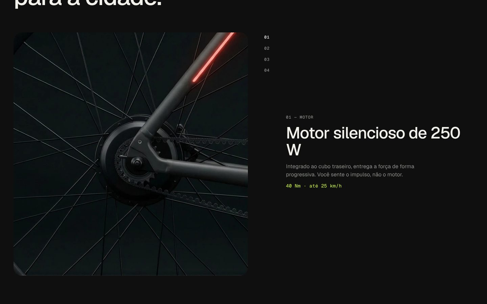
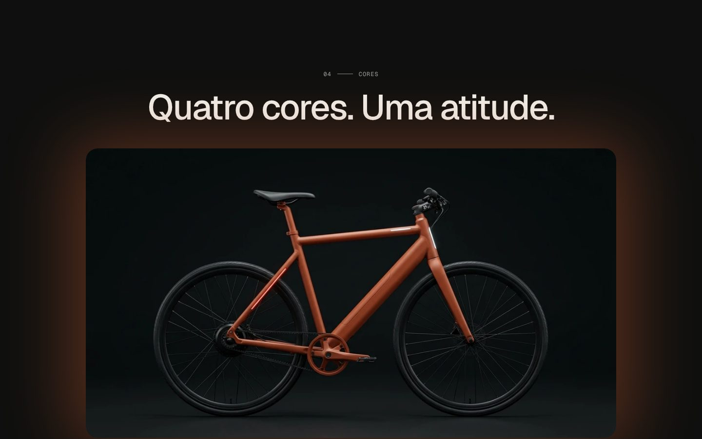
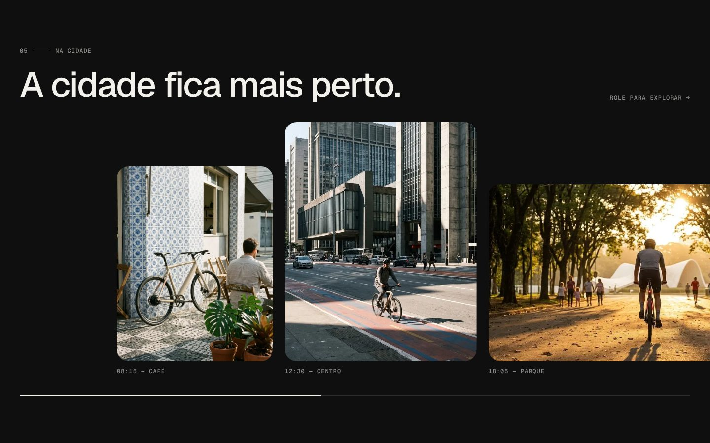
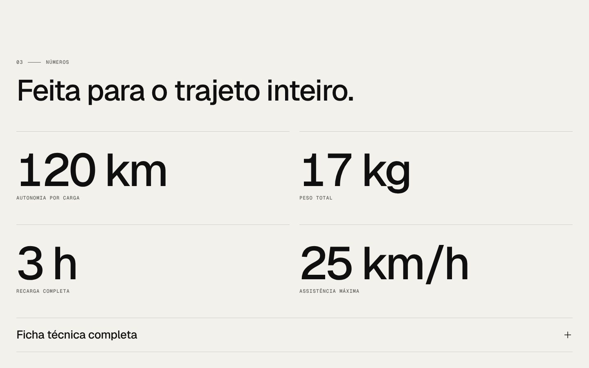
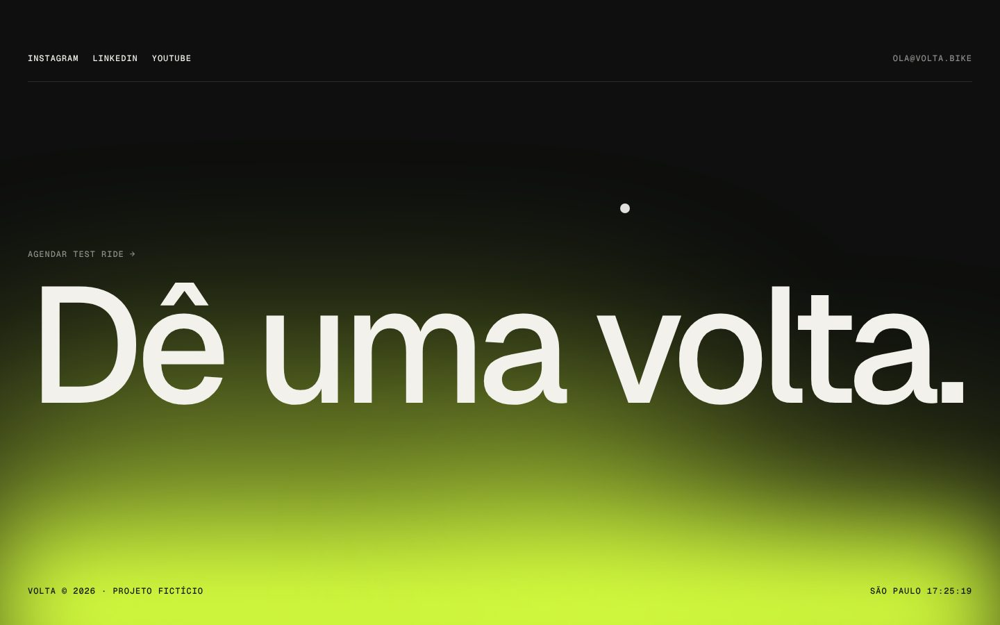
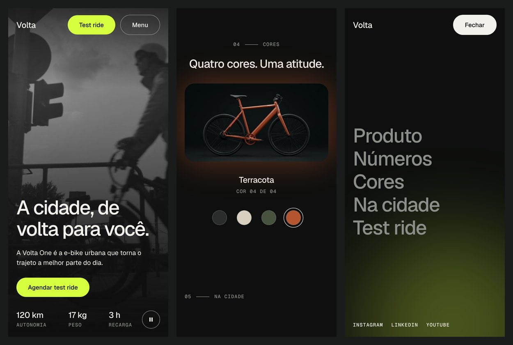

# Volta

Landing page da **Volta One**, uma e-bike urbana fictícia. Projeto de portfólio de front-end, construído do conceito ao código para parecer o site de lançamento de um produto real.

**[Ver o site publicado](https://volta-liart.vercel.app/)** · [Vídeo de navegação](docs/demo.mp4)



## Sobre o projeto

A Volta não existe. Criei a marca, o produto e o conteúdo para ter um problema de front-end completo para resolver: uma página de produto em que a experiência depende de movimento, e em que cada animação precisa ter um motivo para estar ali.

O objetivo era praticar o que uma página desse tipo exige de verdade:

- animações ligadas ao scroll que continuam fluidas;
- componentes pequenos e reutilizáveis, sem abstração além do necessário;
- acessibilidade e desempenho tratados como parte do trabalho, não como etapa final.

## O que tem na página

| Seção | O que acontece |
|---|---|
| **Hero** | Vídeo de fundo com botão de pausa. O título entra linha a linha; ao rolar, o vídeo encolhe e ganha cantos arredondados. |
| **Manifesto** | As palavras do texto acendem conforme o scroll avança. Quatro fotos se movem em velocidades diferentes (parallax). |
| **Detalhes** | A foto fica presa na tela enquanto os textos rolam. O item que cruza o meio da tela troca a imagem. |
| **Números** | Contadores sobem de zero ao entrar na tela. Ficha técnica em acordeão. |
| **Cores** | Seletor de quatro cores que troca a foto da bike e o brilho atrás dela. |
| **Na cidade** | Galeria horizontal: a seção fica presa e o scroll vertical move a faixa para o lado. No celular, arraste nativo. |
| **Test ride** | Formulário com validação por campo, estado de envio e mensagem de sucesso. |
| **Footer** | A frase gigante é o link final para o formulário. Manchas de cor flutuam e seguem o cursor. |

Também há menu em tela cheia, scroll suave, cursor personalizado, botões magnéticos e página 404.

<table>
  <tr>
    <td></td>
    <td></td>
  </tr>
  <tr>
    <td></td>
    <td></td>
  </tr>
  <tr>
    <td></td>
    <td></td>
  </tr>
</table>



## Tecnologias

- **Next.js 16** (App Router) e **React 19**, em JavaScript
- **Tailwind CSS v4**, com os tokens de design definidos em CSS (`@theme`)
- **Motion** para as animações ligadas ao scroll e à entrada na tela
- **Lenis** para o scroll suave
- **Figma** para o layout e o mini design system
- ESLint e Prettier

## Decisões de desenvolvimento

**CSS primeiro, JavaScript quando precisa.** O `position: sticky`, o acordeão (`<details>`), o seletor de cores (radios nativos com `:has()`), o fade do menu e as manchas do footer são só HTML e CSS. O Motion entra onde o valor depende da posição do scroll, que é o que CSS ainda não resolve bem em todos os navegadores.

**Elementos nativos antes de recriar comportamento.** O menu é um `<dialog>` com `showModal()`: o navegador prende o foco, fecha com Esc e devolve o foco ao botão. O seletor de cores usa `<input type="radio">`, então as setas do teclado já funcionam e o leitor de tela anuncia "3 de 4" sem código extra.

**Server components por padrão.** Só leva `"use client"` o que tem estado ou escuta eventos. No hero, por exemplo, a seção é renderizada no servidor e apenas o vídeo e o botão de pausa são componentes de cliente.

**Conteúdo separado da estrutura.** Textos, specs e imagens ficam em `src/data/site.js`. Os componentes recebem dados e cuidam de layout e comportamento.

**Tipografia fluida.** Os tamanhos de título usam `clamp()` entre o valor mobile e o desktop, sem media queries.

## Desafios técnicos

**O maior elemento da página esperava o JavaScript.** A entrada do título do hero era animada pelo Motion, então o texto só aparecia depois da hidratação. No Lighthouse mobile isso atrasava o LCP em cerca de dois segundos. Reescrevi a entrada do hero em CSS puro: ela começa no primeiro quadro, e a nota de desempenho mobile subiu de 81 para cerca de 90.

**Galeria horizontal presa ao scroll.** A seção precisa ter exatamente a altura extra que corresponde à distância horizontal a percorrer, para cada pixel de scroll mover a faixa um pixel. Meço a largura da faixa com `ResizeObserver` e aplico a altura por estilo. No celular e com movimento reduzido, o mesmo HTML vira uma faixa com `scroll-snap`.

**Contraste em estados "apagados".** Baixar a opacidade de um bloco inativo é o caminho óbvio, mas derruba o contraste do texto. Nos Detalhes troquei a opacidade por mudança de cor apenas no título e na spec; no Manifesto, defini uma opacidade mínima que mantém 3:1.

**Imagens cortadas pedem mais pixels.** Com `object-fit: cover`, a foto é mais larga que a moldura. Informar ao `next/image` só a largura da moldura fazia ele entregar um arquivo pequeno demais, que o navegador esticava. Ajustei o `sizes` para refletir a largura real necessária.

**Cache de imagem ao trocar um arquivo.** Substituir uma foto mantendo o nome continuava mostrando a versão antiga por horas. Passei a importar as imagens como módulos, o que gera uma URL com hash do conteúdo.

**Scroll suave sem quebrar o resto.** O Lenis só é carregado em dispositivos com mouse ou trackpad, por import dinâmico. No toque, o scroll nativo já tem inércia, então o celular nem baixa a biblioteca.

## Acessibilidade e desempenho

Medições do Lighthouse no build de produção, rodando localmente:

| | Mobile | Desktop |
|---|---|---|
| Desempenho | cerca de 90 | 99 |
| Acessibilidade | 100 | 100 |
| Boas práticas | 100 | 100 |
| SEO | 100 | 100 |

- Auditoria com axe sem violações, em 1440 e 390 px de largura.
- Toda a página é navegável por teclado, com foco sempre visível e link "Pular para o conteúdo".
- `prefers-reduced-motion` desliga parallax, scroll suave, cursor personalizado e autoplay do vídeo. A galeria vira uma faixa de arraste comum.
- O vídeo de fundo tem botão de pausa e para sozinho quando sai da tela.
- Metadados de compartilhamento, `robots.txt`, `sitemap.xml` e link canônico.

## Limitações conhecidas

- O formulário é simulado: valida os campos, mas não envia dados para lugar nenhum.
- A animação de altura do acordeão e o fade de saída do menu usam CSS recente. Em navegadores sem suporte, os dois funcionam sem a transição.
- As fotos de produto têm 1408 px de largura e perdem definição em telas de alta densidade.

## Estrutura

```
src/
├─ app/                  layout, página, estilos globais, 404, robots, sitemap
├─ components/
│  ├─ ui/                Button, Container, Field, SectionLabel
│  ├─ layout/            Header, Menu, Footer, Cursor
│  ├─ sections/          Hero, Manifesto, Details, Numbers, Colors, Gallery, TestRide
│  └─ motion/            peças de animação reutilizáveis (Reveal, Parallax, Counter...)
├─ hooks/                useHeaderScroll, useMediaQuery
├─ lib/                  constantes e utilitários
└─ data/site.js          todo o conteúdo da página
public/
├─ images/               fotos de produto e lifestyle
└─ videos/               vídeo do hero (WebM e MP4, desktop e mobile)
```

## Rodar localmente

Requer Node.js 20 ou superior.

```bash
git clone https://github.com/Sabrina-vlobo/volta.git
cd volta
npm install
npm run dev
```

Abra http://localhost:3000.

Outros comandos:

```bash
npm run build   # build de produção
npm run start   # serve o build
npm run lint    # ESLint
```

Para publicar, copie `.env.example` para `.env.local` (ou configure na hospedagem) e defina `NEXT_PUBLIC_SITE_URL` com o endereço final do site.

## Créditos

- As fotos de produto e a maior parte das fotos de lifestyle foram geradas por IA.
- O vídeo do hero e a foto noturna da galeria vêm de banco de imagens gratuito.
- Fonte: [Geist](https://vercel.com/font), da Vercel.
- Volta é uma marca fictícia, criada só para este projeto.

## Autora

**Sabrina** · [LinkedIn](https://www.linkedin.com/in/sabrina-lobo-522766263/) · [GitHub](https://github.com/Sabrina-vlobo)
